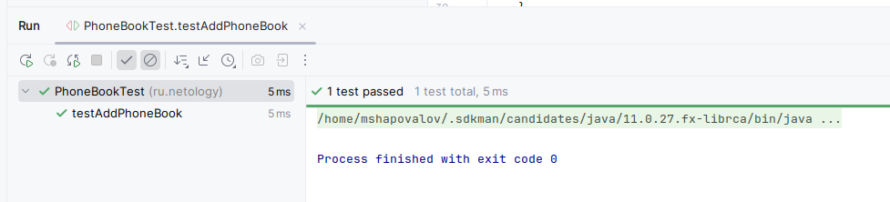

### DDD and TDDD


* для доп изучения https://medium.com/@berrachdim/test-driven-development-tdd-in-java-a-comprehensive-guide-with-examples-c66a77afe036
1) Этап реализуем тестирование метода `add`, основные моменты по данному методу, добавить имя с номером. Метод должен возвращать количество 
контактов после добавления, при этом гарантируется, что не будут добавляться повторяющиеся имена;
- Пишем метод заглушку
```java
public int add(String name, String number){
        return 0;
    }
```
Сначала сделаем @Before чтоб он нам добавлял тестовые данные с которыми будем работать.
``java
@Before
    public void setUp() {
        phoneBook = new PhoneBook();
        phoneBook.add(testName1, testNumber1);
        phoneBook.add(testName2, testNumber2);
    }
``
Первый тестом проверяем, что он просто добавляет наш контакт и не добавляет его повторно!
```java
 @Test
public void testAddPhoneBook() {
   PhoneBook tempPhoneBook = new PhoneBook();
   assertEquals(3, tempPhoneBook.add("Anton", "+79344444545"));
   assertEquals(0, tempPhoneBook.add("Anton", "+79344444545"));
}
```
1 строка должна вернуть 3, так как в @Before уже есть 2 контакта, вторая строка должна вернуть 0, повторное добавление контакта.
Результат, тест упал
```bash
/home/mshapovalov/.sdkman/candidates/java/11.0.27.fx-librca/bin/java -javaagent:/opt/intellij-idea-community/plugins/java/lib/rt/debugger-agent.jar=file:///tmp/capture11132881972828764523.props -ea -Didea.test.cyclic.buffer.size=1048576 -javaagent:/opt/intellij-idea-community/lib/idea_rt.jar=44295 -Dkotlinx.coroutines.debug.enable.creation.stack.trace=false -Ddebugger.agent.enable.coroutines=true -Dkotlinx.coroutines.debug.enable.flows.stack.trace=true -Dkotlinx.coroutines.debug.enable.mutable.state.flows.stack.trace=true -Dfile.encoding=UTF-8 -classpath /opt/intellij-idea-community/lib/idea_rt.jar:/opt/intellij-idea-community/plugins/junit/lib/junit5-rt.jar:/opt/intellij-idea-community/plugins/junit/lib/junit-rt.jar:/home/mshapovalov/java/netology/DDD/TDD/target/test-classes:/home/mshapovalov/java/netology/DDD/TDD/target/classes:/home/mshapovalov/.m2/repository/junit/junit/4.13.2/junit-4.13.2.jar:/home/mshapovalov/.m2/repository/org/hamcrest/hamcrest-core/1.3/hamcrest-core-1.3.jar:/home/mshapovalov/.m2/repository/org/junit/jupiter/junit-jupiter/5.13.0/junit-jupiter-5.13.0.jar:/home/mshapovalov/.m2/repository/org/junit/jupiter/junit-jupiter-api/5.13.0/junit-jupiter-api-5.13.0.jar:/home/mshapovalov/.m2/repository/org/opentest4j/opentest4j/1.3.0/opentest4j-1.3.0.jar:/home/mshapovalov/.m2/repository/org/junit/platform/junit-platform-commons/1.13.0/junit-platform-commons-1.13.0.jar:/home/mshapovalov/.m2/repository/org/apiguardian/apiguardian-api/1.1.2/apiguardian-api-1.1.2.jar:/home/mshapovalov/.m2/repository/org/junit/jupiter/junit-jupiter-params/5.13.0/junit-jupiter-params-5.13.0.jar:/home/mshapovalov/.m2/repository/org/junit/jupiter/junit-jupiter-engine/5.13.0/junit-jupiter-engine-5.13.0.jar:/home/mshapovalov/.m2/repository/org/junit/platform/junit-platform-engine/1.13.0/junit-platform-engine-1.13.0.jar com.intellij.rt.junit.JUnitStarter -ideVersion5 -junit4 ru.netology.PhoneBookTest,testAddPhoneBook

org.opentest4j.AssertionFailedError: expected: <1> but was: <0>
Expected :3
Actual   :0
<Click to see difference>
.....
```

Переделал, так как второй раз добавления нового контакта должен вернуть 0 и чтобы проверить что добавление не произошло, то делаем `assertNotEquals`
```bash
org.opentest4j.AssertionFailedError: expected: <1> but was: <0>
Expected :1
Actual   :0
```

Реализация метода `add`
```java
 public int add(String name, String number){
   if(name ==null || number ==null){
      return 0;
   }
   if( !phoneBook.containsKey(name)){
      phoneBook.put(name, number);
      return phoneBook.size();
   }
   return 0;
}
```
Проверяем на вход не пустые значения, если они не пусты, то ищем уникальный контакт, если его нет в нашей Map то добавляем новый контакт.

Результат, тесты зеленные.


2) Реализуем тестирование второго метода из класса PhoneBook, основные описание поведения метода
   findByNumber — найти имя по номеру без полного перебора;
```java

    @Test
    public void findByNumber() {
        assertEquals("test2",phoneBook.findByNumber("+79999999999"));
    }
```
Результат теста красный,
```bash
org.opentest4j.AssertionFailedError: 
Expected :test2
Actual   :null
```

Для тестирования данного метода, мы сначала добавляем тестовые данные, так как Map в начале пустой и потом ищём необходимый контакт.
Реализация данного метода:
```java
  public String findByNumber(String number){
        if(!phoneBook.isEmpty()) {
            return phoneBook.
                    entrySet().
                    stream().
                    filter(entry -> number.equals(entry.getValue())).
                    map(Map.Entry::getKey).
                    findFirst().
                    get();
        }
        return null;

    }
```

Результат тест зеленый

3) findByName — найти номер по имени без полного перебора;
```java
@Test
public void testFindByName(){
    assertEquals("+79999999999", phoneBook.findByName("test2") );
}
```

Реализация 
```java
 public String findByName(String name){
       return phoneBook.get(name);
    }
```
4) printAllNames — вывести все имена в алфавитном порядке без необходимости проводить сортировку.

```java
 public void testPrintAllNames(){
        List<String> sortName = new ArrayList<>();
        sortName.add(testName1);
        sortName.add(testName2);
        Collections.sort(sortName);
        assertEquals(sortName, phoneBook.printAllNames());
    }
```
Результат
```bash
org.opentest4j.AssertionFailedError: expected: <[Test2, User]> but was: <null>
Expected :[Test2, User]
Actual   :null
<Click to see difference>

```
Итоговый метод, который возвращает отсортированный список всех абонентов
```java

    public List<String> printAllNames(){
        List<String> l = new ArrayList<String>(phoneBook.keySet());
        Collections.sort(l);
        return l;
    }

```


* Важное замечание, каждый тест по отдельности работает, но в конце они стали падать, пришлось в логику
проверки добавления новых контактов внести правки.